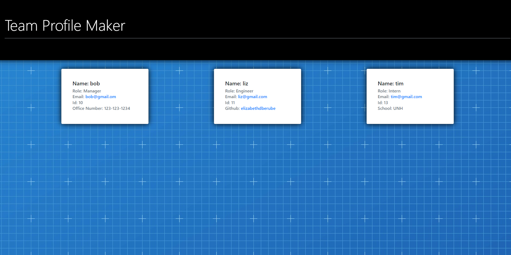

# Team-Profile-Maker

 
## Description
Some features of this application:
1. User can answer prompts in the command line to build a team roster.
2. Once user answers prompts and clicks the finish building team option then the HTML is generated.
3. Once the team roster is created user can click on an email address and the default email program will open.
4. GitHub address of team member's can be clicked on and the GitHub profile will open in a new tab. 
5. All the team's name, employee ID's, role and email is in roster. Also, for certain employees the GitHub, School and Office number is displayed.  

A picture of the application, a link to walkthrough video, a link to the GitHub repository, link to website generated by Team Profile Maker and a link to the sample HTML file are located at the bottom of this README. The sample HTML file is also included in the repository. 

---

## Table of content

* [Description](#description)

* [Installation](#installation)

* [Links](#links)

* [Questions](#questions)

---

# Installation 

Use the following package manager

NPM
  
## Questions

If you have nay questions about this project then you can contact me directly at 

elizabethdberube@gmail.com
----

## Links

Link to GitHub repository: https://github.com/elizabethdberube/Team-Profile-Maker

Link to walkthrough video:
https://drive.google.com/file/d/17i0AUAewxQdnvIF29IQJ_pP8LACWJIy9/view

Link to sample HTML file:
https://github.com/elizabethdberube/Team-Profile-Maker/blob/main/dist/index.html

